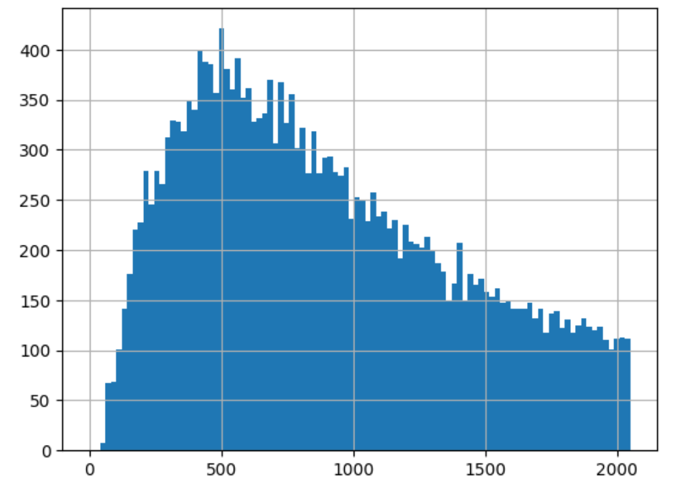

# code-embeddings
My NLP pet-project, which is used for code embeddings research in programmimg.

# To start with: выбор датасета
В постановке задачи был рекомендован датасет CodeSearchNet, однако за основу я взяла найденный на Codeforces датасет Code_contests от Deepmind. Для представленной задачи его преимущество в том, что код (который является решением задач на cf) представлен сразу на нескольких языках программирования, что позволяет оценить качество модели путем сравнения эмбеддингов, полученных на основе разного синтаксиса предложений.

Множество полученных решений выглядит так:

